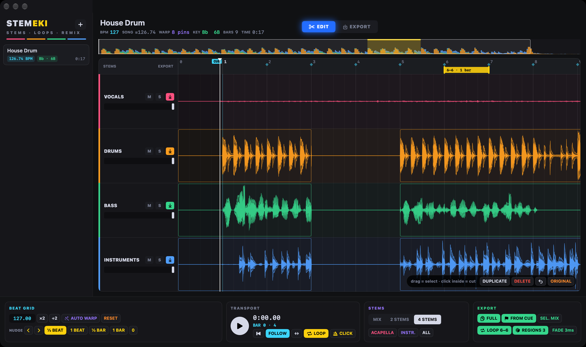
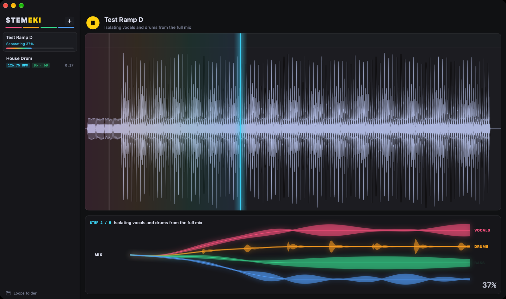
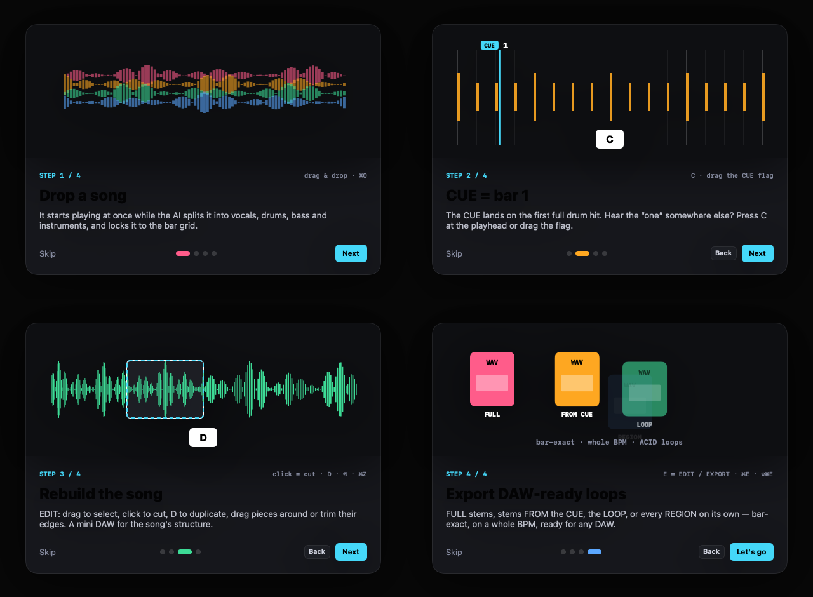

# STEMEKI – stemek · loopok · remix

[🇬🇧 English](README.md) · 🇭🇺 Magyar

**▶ Weboldal:** [ekidio.github.io/stemeki](https://ekidio.github.io/stemeki/) · **⬇ Letöltés:** [legújabb kiadás (DMG)](https://github.com/Ekidio/stemeki/releases/latest)



A **STEMEKI** bármilyen dalt stemekre bont, ütemre pontos rácsra igazít, mini DAW-ként átrajzolhatod a dal szerkezetét, és **DAW-kész loopokat** exportál: ütemre pontos hosszban, egész BPM-en, bármelyik projektbe behúzhatóan.

Natív macOS-alkalmazás (Swift, Apple Silicon). A szétbontás helyben fut, a Demucs 4 végzi az Apple GPU-n, a zenéd nem hagyja el a gépet.

A STEMEKI egy **EKIDIO SOUND** alkalmazás. Lásd még: [PADEKI](https://github.com/Ekidio/padeki) · [DAWEKI V3](https://github.com/Ekidio/daweki_v3).

## Miben más

A legtöbb stembontó ott megáll, hogy „itt a négy fájl”. A STEMEKI innen indul:

- **Smart Tempo.** Egy betanított beatfelismerő (Beat This!) a teljes mixet hallgatva megtalálja az összes beatet és az 1-est, ahogy a DJ-appok és a Logic. Minden beat a valódi hangindítására kerül, és ahol a dal egy tempót tart, a rács egyetlen tökéletesen egyenes vonal kerek BPM-mel; ahol tényleg gyorsul vagy lassul, szakaszonként követi.
- **CUE = 1. ütem.** A CUE a dal első ütemkezdetére kerül. A lejátszófejnél a **C**-vel (lejátszás közben is) vagy a zászló húzásával bármelyik beatet „egyessé” teheted.
- **Átrajzolod a dalt.** **EDIT** módban kijelölsz, kattintással vágsz, **D**-vel duplikálsz, mozgatod a darabokat, rövidíted a széleiket. A lerakott darab felülírja, amit takar, mint egy DAW-ban.
- **A szerkezetet exportálod, nem csak a dalt.** **EXPORT** módban régiókat rajzolsz a sávokra, és mindegyik külön loopként mentődik.

## Funkciók

### Betöltés
- WAV, AIFF, MP3, M4A vagy FLAC. A dal azonnal szól, amíg az AI szétbontja, animált képernyő mutatja a haladást.
- **MIX / 2 STEMS / 4 STEMS** nézet: az egész dal egy hullámformán, ének + kíséret, vagy ének, dob, basszus és hangszerek.
- Pontos BPM- és hangnemfelismerés (Camelot-kóddal).

### Ütemrács
- **AUTO WARP** minden beatet a saját ütéséhez rögzít, a **RESET** visszaállítja a felismertet.
- **CUE HERE (C)**, húzható CUE-zászló, **NUDGE**: a zene léptetése a rácshoz képest ½ beattel, 1 beattel, ½ vagy 1 ütemmel.
- **CLICK** metronóm feszes, kattanó hanggal (az 1-esen magasabb), fülre finomhangolható (jobb klikk).
- Exporttempó: a loopok pontosan erre a BPM-re nyúlnak (a hangmagasság marad), vagy maradhat a dal saját tempója.

### Szerkesztés (EDIT mód)
- Húzás = kijelölés, kattintás bele = vágás, **D** = duplikálás (a még el nem vágott kijelölést előbb elvágja), ⌥-húzás = másolat, ⌫ = törlés (csend), ⌘Z / ⇧⌘Z = visszavonás / újra.
- A nagyítástól függően ütemre, beatre, közelről **1/8**-os és **1/16**-os vonalakra igazodik. A darabok széle húzható.
- **⌘C / ⌘V**: a kijelölt darab (vagy a kijelölés alatti hang) másolása, kattints oda, ahová kell (megjelenik a ⌘V jel), beillesztés. Újabb ⌘V közvetlenül utána rakja a következőt.
- **U**: a loop felveszi a kijelölt darab vagy régió elejét és végét, és követi, ha mozgatod vagy rövidíted.
- A darabok **a dal végén túlra** is húzhatók: az idővonal velük nő, így hosszabb mix készíthető (a FROM CUE az egészet exportálja).
- **Fade-ek**: a darab felső sarkán lévő kis négyzetet befelé húzva fade-in / fade-out (dupla kattintás törli). A lejátszás, a loop és minden export követi.
- Minden sávon **RESET**: vissza a frissen szétbontott stemre.

### Projektek
- **File → Save Project (⌘S)**: `Cím.stemeki` fájl a stemekkel, vágásokkal, fade-ekkel, régiókkal, ráccsal, CUE-val, loopal és a sávok hangerejével. Megnyitás: **Open Project (⇧⌘O)**, dupla kattintás vagy ráhúzás az ablakra – azonnal kész, nincs újabb szétbontás.
- A dallistában pont jelzi a mentetlen változást; kilépéskor rákérdez, mielőtt bármi elveszne.

### Export (EXPORT mód)
| Gomb | Mit ment | Tempó | Szerkesztések |
|---|---|---|---|
| **FULL** | a jelölt sávok úgy, ahogy vannak, a teljes fájl | eredeti | nélkülük |
| **FROM CUE** | az 1. ütemtől a végéig – DAW-ban az 1. ütemtől egymás alá teheted | export BPM | velük |
| **LOOP** | a loop tartománya, ütemre pontosan | export BPM | velük |
| **REGIONS** | minden régió a jelölt sávokon, külön fájlonként | export BPM | velük |

- **SEL. MIX**: a jelölt sávok egy fájlba keverve (pl. DRUMS+BASS), a faderek szerint.
- Ha egy sávot kiveszel az exportból, el is némul: azt hallod, amit exportálsz.
- A fájlok az eredeti formátumban készülnek (WAV / AIFF / FLAC, bitmélység, mintavétel). A WAV loopokban **ACID** és **smpl** adat van (tempó, ütésszám, alaphang, loop-pontok), és egy „Made with STEMEKI” megjegyzés.
- Minden exportnál kiválasztod a mappát. Fájlnév: `Cim_DRUMS_127bpm_REGION_17_20.wav`.

| Feldolgozás | Első indítás |
|---|---|
|  |  |

## Billentyűk
| Billentyű | Funkció |
|---|---|
| Szóköz | lejátszás / szünet |
| Enter | a dal elejére (FOLLOW mellett a nézet is) |
| L | loop be / ki |
| K | metronóm be / ki |
| C | CUE a lejátszófejhez |
| E | EDIT / EXPORT |
| D | a kijelölés duplikálása |
| U | loop a kijelölésre (a loop követi) |
| ⌘C / ⌘V | másolás / beillesztés a kattintott helyre |
| ⌘S / ⇧⌘S | projekt mentése / mentés másként |
| ⇧⌘O | projekt megnyitása |
| ⌫ | a kijelölés törlése |
| Esc | kijelölés megszüntetése |
| [ / ] | NUDGE: a zene korábbra / későbbre |
| ⌘Z / ⇧⌘Z | visszavonás / újra |
| ⌘E / ⇧⌘E | LOOP / REGIONS export |

## Követelmények
- Apple Silicon Mac, macOS 14 vagy újabb.
- Más semmi. Első indításkor a STEMEKI felajánlja az **INSTALL ENGINE** gombot: egy kattintással letölti a saját AI-motorját (Python + Demucs 4 + a modell, kb. 300 MB, a lemezen 1 GB) a `~/Library/Application Support/STEMEKI` mappába. Nem kell hozzá Terminál, sem Python-tudás.
- Van már Python 3.10+ `demucs librosa soundfile` csomagokkal? A STEMEKI megtalálja és azt használja (pyenv, Homebrew vagy a rendszer Pythonja), nincs telepítés.

## Telepítés
1. Töltsd le a DMG-t a [legújabb kiadásból](https://github.com/Ekidio/stemeki/releases/latest), és húzd a **STEMEKI**-t az Alkalmazások mappába.
2. Első indításkor a macOS letilthatja: kattints a **Kész** gombra, majd **Rendszerbeállítások → Adatvédelem és biztonság → Megnyitás mindenképp**.
3. A frissítések maguktól jönnek (Sparkle), vagy: **STEMEKI → Check for Updates…**.

## Fordítás forrásból
```bash
./build.sh --install     # dist/STEMEKI.app, és bemásolja a ~/Applications mappába
./make-dmg.sh            # dist/STEMEKI-<verzió>.dmg
./make-release.sh        # DMG + aláírt appcast egy GitHub-kiadáshoz
```

---
© 2026 EKIDIO SOUND. Szétbontás: [Demucs](https://github.com/facebookresearch/demucs) (MIT), beatek: [Beat This!](https://github.com/CPJKU/beat_this) (JKU Linz, MIT).
